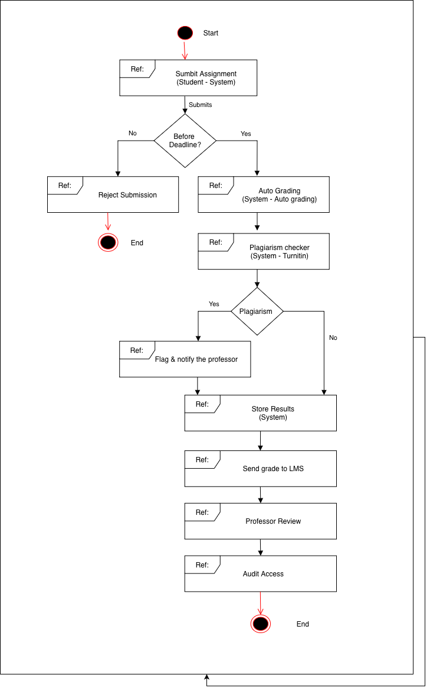
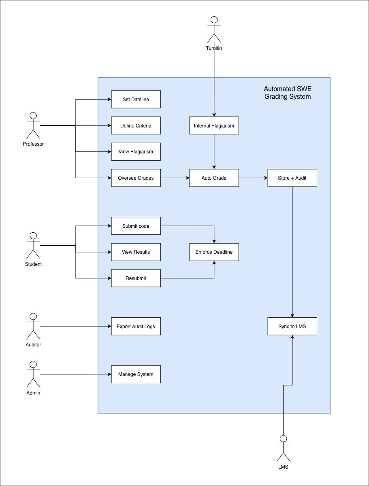
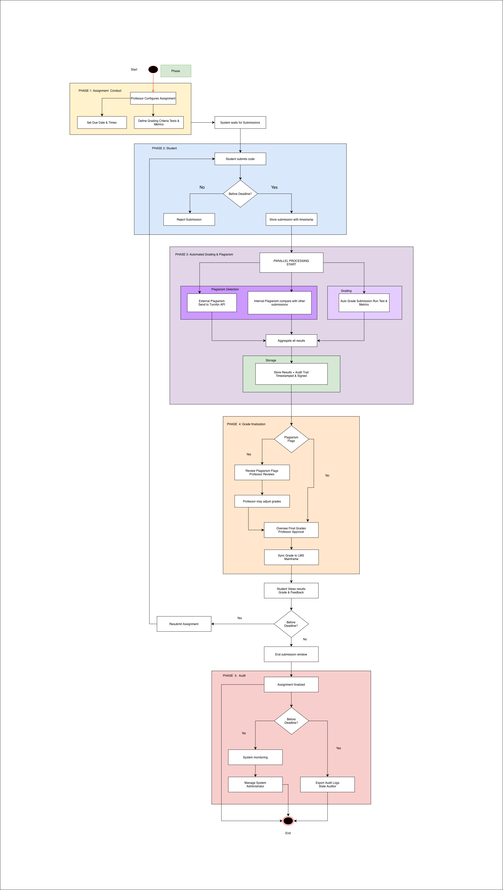

# SS2026_SDA202_02240371
# Automated Grading System – UML Design

# Table of Contents

1. [Overview](#overview)  
2. [Objectives](#objectives)  
3. [Actors](#actors)  
4. [Diagrams Included](#diagrams-included)  
5. [Constraints & Challenges](#constraints--challenges)  
6. [Outcome / Benefits](#outcome--benefits)  
7. [Lessons Learned & Future Improvements](#lessons-learned--future-improvements)  
8. [Conclusion](#conclusion)  
9. [References / Tools Used](#references--tools-used) 

## Overview
The project is about developing an **Automated Grading System** for the university's Software Engineering course, SWE. This system is designed to replace the existing manual system with an efficient, effective, and reliable system that supports the execution of the code.

The existing system is where the students submit their assignments through GitHub, and the professors manually clone the code and execute the code. This is not an efficient system, especially when there are more than 300 students enrolled in the course every year.

Therefore, there is a need to create an automated system that is capable of efficiently handling the submission, execution, and evaluation of the assignments given to the students. This proposed system is expected to enable the students to submit their code, which is then executed and evaluated against some criteria. This system is expected to reduce the burden involved in the process and make the evaluation more efficient. So, as students studying Software Architecture, we were tasked with designing UML diagrams for this system.

---

## Objectives
- Automate grading of programming assignments  
- Provide for **persistent and auditable** grading records  
- Provide for integration with plagiarism detection tools such as TurnItIn  
- Allow for multiple submissions prior to deadlines  
- Integrate with existing **University LMS**  
- Help reduce manual work for professors

---

## Actors:

### 1. Student (Primary Actor)
- Here, the student is the primary user of the system who needs to submit programming assignments in the source code. 
- The student can view the marks after evaluation. 
- They are also allowed to resubmit the assignments multiple times before the deadline to perform better.

### 2. Professor (Primary Actor)
- The professor is responsible for managing the evaluation process. 
- They needs to manage the deadline for the assignments, the test cases or evaluation metrics for the assignments, the plagiarism reports, and the final marks provided to the students.

### 3. Administrator (Secondary Actor)
- The administrator is responsible for supporting the system in terms of user account management, system operation, and system performance for effenciency. 

### 4. State Auditor (External Actor)
- The state auditor is an external actor that is responsible for ensuring that there is compliance with state laws. 
- They uses audit logs provided by the system in order to ensure transparency, accuracy, and fairness in the grading process during annual audits.

### 5. TurnItIn API (External System)
- TurnItIn is an external system that helps in plagiarism detection. 
- It works by receiving student submissions and comparing them against existing sources, then generating a report that helps in the detection of dishonesty.

### 6. LMS Mainframe (External System)
- This system is the existing learning management system of the university. 
- It receives grades from the automated grading system and is used as the official system for storing and managing student records, even though it is a legacy system.

---

## Diagrams Included

### 1. Interaction Overview Diagram (IoD – Actor Perspective)
This diagram is an overview of how interactions among various actors are carried out in order to attain the overall business objective of automated grading. In this diagram, we are not required to go into much detail about the systems, only how these actors interact with each other. This diagram will provide us with an overview of how interactions are carried out from the start of assigning an assignment to the end of grading it. 

---

### 2. Use Case Diagram (UCD)
Use Case Diagram describes the functional requirements of the system, showing the interactions between the actors and the system. The diagram highlights the important use cases, such as submitting assignments, setting criteria for grading, performing tests, checking for plagiarism, and viewing results. The diagram describes what the system needs to perform in order to meet user requirements. It also presents a detailed overview of system functionalities from the user's point of view.

---

### 3. Detailed Interaction Overview Diagram (System-Supported IoD)
This diagram extends the previous IoD and adds system-level processes to show how the system supports interactions between actors. It shows a more detailed workflow, including internal components of the system, such as the auto-grader and plagiarism detection system. The diagram shows how all the processes are coordinated within the system to produce the final result, including code execution, grading, and storage, as well as external interactions such as the LMS and TurnItIn.

---

## Constraints & Challenges
1. **Limited IT Budget**  
   - The solutions should favor open-source technologies and inexpensive infrastructure.  
   - The solutions should avoid expensive software licenses and proprietary systems.  

2. **Legacy LMS Integration**  
   - The LMS might be outdated or even a mainframe-based system.  
   - The solutions should be compatible with the data and authentication schemes already in place.

3. **Regulatory Compliance**  
   - Audit logs and grading records should be tamper-proof and stored securely.  
   - Track submissions, grading, and plagiarism checks with timestamps.  

4. **Scalability**  
   - The system should be able to handle large submissions, especially during peak periods close to deadlines.  
   - Backend services should be horizontally scalable.

5. **Security**  
   - Prevent unauthorized access, data breaches, and malicious code execution.  
   - Utilize sandboxing for code execution and APIs for all interactions.  

6. **Maintainability & Future-Proofing**  
   - Ensure that the modules are easily updatable and that new grading rules or languages can be integrated.  
   - Minimize future development and maintenance costs.

---

## Outcome / Benefits

- **Efficiency**: It saves time for instructors, who can then focus on teaching and mentoring.  
- **Accuracy**: It eliminates any scope for errors, as tests are automated.  
- **Fairness**: It helps maintain academic integrity, as there are tools for plagiarism detection and transparent grading criteria.  
- **Scalability**: It can handle a large number of student submissions without any performance problems.  
- **Iterative Learning**: It allows for repeated submissions, so students can keep learning and improve.  
- **Audit & Compliance**: It maintains a history of all grading activities, ensuring traceability.

## Lessons Learned & Future Improvements

### **Lessons Learned**  
  - Developing a system that integrates with existing LMS systems is key.  
  - Scalability is also an important feature that must be thought of early on in development.  
  - Balancing automated grading with plagiarism detection is also key.  

### **Future Improvements**  
  - More programming languages could be supported.  
  - Real-time dashboards could be implemented.  
  - Plagiarism detection could be improved using AI.  
  - Analytics could be provided for instructors.

---

## Conclusion

The Automated Grading System developed in this lab is more efficient, accurate, and equitable in assessing students' programming assignments. The system also resolves issues in integrating with old LMS systems, scalability, and compliance with regulations.  

This project has provided valuable insights on how to develop more effective, modular, and scalable software systems. There is room for further development of the system, including AI-based plagiarism detection tools, live feedback mechanisms, and support for multiple programming languages.  

This project shows that good system design is crucial in creating more effective tools in system development.

---

## References / Tools Used

- **Diagram Tools**:  
  - Draw.io – It is used for generating UML diagrams (IoD & Use Case Diagrams).  

- **Information Sources & Assistance**:  
  - DeepSeek – for information, descriptions, and system design examples.  
    *Personal DeepSeek conversations used:* 
    https://chat.deepseek.com/share/d5temdvo96gywtiofs
  - ChatGPT – for information and guidance on structuring, examples, and formatting.  
    *Personal ChatGPT conversations used:* 
    https://chatgpt.com/share/69ca9f07-a3bc-83e8-a900-556be03f551e
    https://chatgpt.com/share/69ca9f19-f810-83e8-a740-c010ebf1c43b