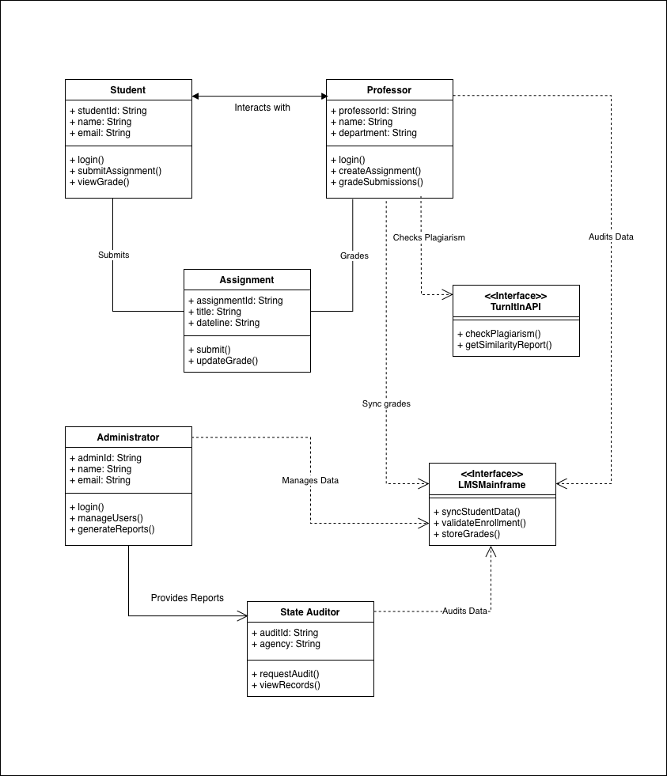
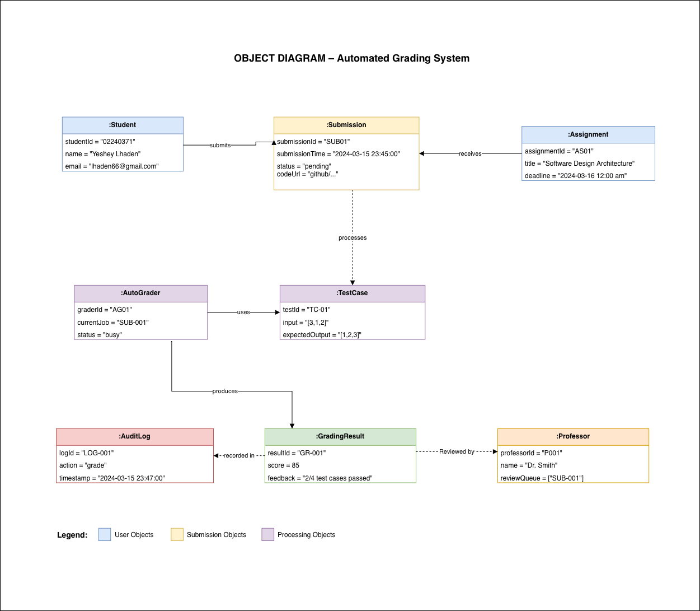

# Automated Grading System

## Overview

The purpose of the **Automated Grading System** is to make it easier for the assignment lifecycle management process, from assignment submission to assessment, to be streamlined with accuracy and precision, plagiarism detection, compliance monitoring, etc., through support for multiple users, like students, professors, auditors, etc., and interfacing with third-party applications such as Turnitin and LMS. The Automated Grading System saves time, effort, and energy by automatically performing repeated grading processes and synchronizing results and log maintenance.

The Automated Grading System is modeled with the help of the **UML Class & Object Diagram**, whereby class diagrams provide the complete blueprint of the system along with the actors and their interaction relationships, while object diagrams focus on particular cases or scenarios during execution.

---

## UML Class Diagram:

## 1. System Actors (Classes)

### 1.1 Student
- **Description**: An object that represents a student taking part in a class.
- **Properties**:
  - `studentId: String` – The unique ID of the student.
  - `name: String` – Name of the student.
  - `email: String` – Email of the student.
- **Behaviors**:
  - `login()` – This method authenticates a student.
  - `submitAssignment()` – Submits an assignment to the system.
  - `viewGrade()` – Shows the grades earned by the student after completing an assignment.

### 1.2 Professor
- **Description**: An instructor responsible for assignment management and grading submissions.
- **Fields**:
  - `professorId: String` – A unique ID assigned to each professor.
  - `name: String` – The full name of the professor.
  - `department: String` – Department where the professor belongs.
- **Functions**:
  - `login()` – Login function for the professor.
  - `createAssignment()` – Create assignments for students.
  - `gradeSubmissions()` – Grade submissions manually or auto-submissions.

### 1.3 Administrator
- **Description**: Controls overall data and user accounts.
- **Properties**:
  - `adminId: String` – Unique identifier for the administrator.
  - `name: String` – Name of the administrator.
  - `email: String` – Email address of the administrator.
- **Functions**:
  - `login()` – Validates the administrator's credentials.
  - `manageUsers()` – Manages users' creation, modification, and deletion.
  - `generateReports()` – Generates reports on system usage and compliance.

### 1.4 State Auditor
- **Definition**: An external organization that performs an audit on the system’s records.
- **Properties**:
  - `auditId`: String – ID of the audit request.
  - `agency`: String – Name of the auditing agency.
- **Functions**:
  - `requestAudit()` – Performs a compliance audit.
  - `viewRecords()` – Views logs and grades within the system.
---

## 2. Supporting Classes

### 2.1 Submission
- **Description**: Models a submission by a student.
- **Properties**:
  - `assignmentId: String` – Indicates the ID of the corresponding assignment.
  - `title: String` – Submission title.
  - `dateTime: String` – Submission date and time.
- **Functions**:
  - `submit()` – Submits the finalized submission.
  - `updateGrade()` – Updates the grade of the submission.

### 2.2 Grades
- **Description**: Contains grades of students' works.
- **Attributes**:
  - `assignmentId: String` – Reference to an assignment.
  - `title: String` – Name of the assignment.
  - `datetime: String` – Time when the work is graded.

---

## 3. External Interfaces

### 3.1 TurnitinAPI (Interface)
- **Description**: Used to detect plagiarism within submitted works.
- **Methods**:
  - `checkPlagiarism()` – Checks the work on plagiarism.
  - `getSimilarityReport()`

### 3.2 LMSMainframe (Interface)
- **Objective**: Synchronization of the data with a foreign Learning Management System.
- **Methods**:
  - `syncStudentData()` – Loads the data on students.
  - `validateEnrollment()` – Validates the student’s enrollment.
  - `storeGrades()` – Uploads final grade information.

---

## 5. Relationships and Interactions

- **Student ↔ Submission** The student communicates with the submission component (submission creation and submission).
- **Professor → TurnitinAPI** Professor verifies plagiarism through the API.
- **Professor → Audit Data** Professor has the ability to audit the submission and grade data.
- **Administrator → State Auditor** Administers provide information to the state auditor. 
- **Administrator → Data** Administrator handles all system data.
- **Grades ↔ LMSMainframe** The grades are synchronized with the external Learning Management System.

---

## Object Diagram:

## 6. Purpose of the Object Diagram

- **Validation** Proves that the class associations could be instantiated.
- **Debugging** Displays one specific state of the system (for example, while assigning grades).
- **Communication** Demonstrates exactly how the data flows among objects.
- **Test Cases** Helps create test cases to use for testing purposes.

---

## 7. Object Instances (by Type)

### 7.1 User Objects

#### Student Object
| Attribute        | Value           |
|-----------------|-----------------|
| studentId       | "02240371"      |
| name            | "Yeshey Lhaden" |
| email           | "lhaden66@gmail.com" |

**Explanation:** An instance of the student who has enrolled into classes to submit assignment and view grades.

#### Professor Object
| Attribute          | Value               |
|-------------------|---------------------|
| professorId        | "P001"              |
| name              | "Dr. Smith"         |
| reviewQueue       | ["SUB-001"]         |

**Explanation:** Currently Dr. Smith is working on the submission `SUB-001` for review.

### 7.2 Submission Objects

#### Assignment Object
| Attribute        | Value              |
|------------------|--------------------|
| assignmentId     | "AS01"             |
| title            | "Software Design Architecture"       |
| deadline         | "2024-03-16 12:00 am"   |

**Interpretation:** Specific assignment with a deadline at midnight.

#### Submission Object
| Attribute        | Value              |
|------------------|--------------------|
| submissionId     | "SUB01"            |
| submissionTime   | "2024-03-15 23:45:00"     |
| status           | "pending"          |
| codeUrl          | "github/..."      |

**Interpretation:** The assignment was submitted by the student just before the deadline. However, its status is "pending," i.e., not graded yet.

---

### 7.3 Processing Objects

#### AutoGrader Object
| Attribute        | Value              |
|------------------|--------------------|
| graderId         | "AG01"             |
| currentJob       | "SUB-001"          |
| status           | "busy"             |

**Interpretation:** An automatic grader is processing

#### TestCase Object
| Field   | Value             |
|---------|------------------|
| testId  | "TC-01"           |
| input   | "[3,1,2]"          |
| output  | "[1,2,3]"         |

**Explanation:** This is a sorting test case in which the input value `[3,1,2]` must be sorted to `[1,2,3]`.

#### GradingResult Object
| Field   | Value     |
|---------|----------|
| resultId | "GR-001"  |
| score   | 85        |
| message | "2/4 test cases passed" |

**Explanation:** The student earned 85% with only 2 out of 4 test cases passed.

#### AuditLog Object
| Field   | Value                   |
|---------|------------------------|
| logId   | "LOG-001"              |
| action  | "grade"                 |
| dateTime| "2024-03-15 23:47:

---

## 8. Relationship Between Objects & Scenario Trace

### 8.1 Runtime Scenario
Student (Yeshey Lhaden)
-> Submits -> Assignment (AS01)
-> Creates -> Submission (SUB01)
-> Processed By -> AutoGrader (AG01)
-> Uses -> TestCase (TC-01)
-> Generates -> GradingResult (GR-001)
-> Recorded By -> AuditLog (LOG-001)
-> Checked By -> Professor (Dr. Smith)

---

## 9. Comparison: Class Diagram vs. Object Diagram

| Attribute | Class Diagram | Object Diagram |
|-----------|---------------|----------------|
| Purpose | Indicates blueprint of the system, relationships | Indicate snapshot of the system at particular time |
| What does it indicate? | Shows classes, interfaces and abstract types | Shows objects and its properties (instances) with actual values |
| Attributes | Only types (such as int, String) | Actual values (such as 85, “02240371”) |
| Methods/Functions | Method signatures only (such as + login()) | No methods but indicates state of objects |
| Relationships | Shows inheritance, interfaces and multiplicity (such as 1..*) | Indicates relationships between objects |
| Number of entities | Shows all possible classes | Shows specific objects at a particular time |
| Development | For designing database, APIs, and generating code | Helps in testing, debugging and documentation of specific scenarios |
| Stability | Generally **static** | Dynamic |

---

## Conclusion:
The report shows how **Automated Grading System** could be used to improve academic processes through automated grading, consistent data management, and powerful auditing and reporting functionality.